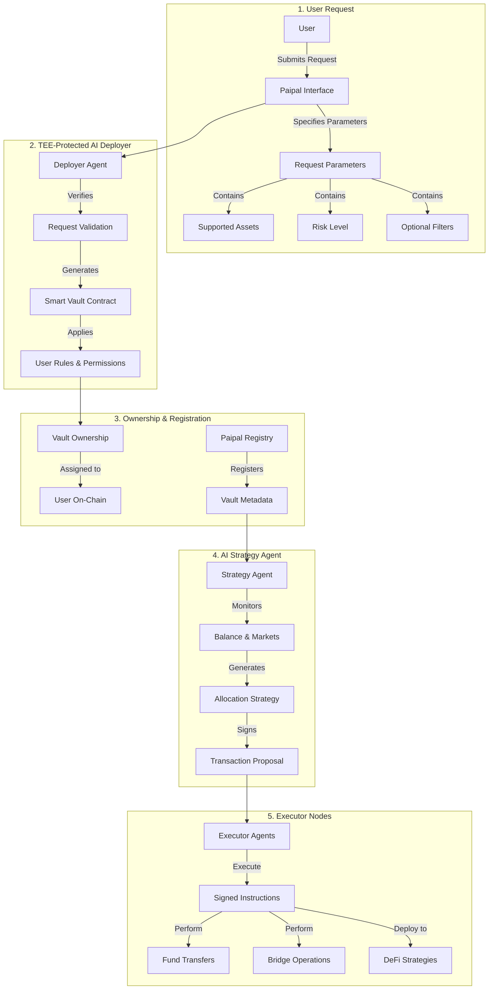

# Vault Deployment Flow

AI-to-AI Coordination for Secure, Automated DeFi

## System Flow Diagram

## Process Flow

### 1. User Requests Vault Creation

A user submits a vault creation request via the Paipal interface or smart contract.

They specify:

1. Supported assets (e.g. USDC, ETH)
2. Risk level (e.g., low, medium, degen)
3. Optional filters or constraints

### 2. TEE-Protected AI Deployer Instantiates the Vault

The request is handled by the Deployer Agent, an AI running inside a Trusted Execution Environment (TEE).

This agent:

1. Verifies the request
2. Generates the smart vault contract
3. Applies user-defined rules and permissions

Permissions are minimal and trustless:

1. Only the user can trigger withdrawals
2. Only verified Executor Agents can move funds into strategies (never to arbitrary wallets)
3. Cross-chain transfers are permissioned via secure channels (e.g., AggLayer + TEE signatures)

### 3. Ownership Assignment & Vault Registration

1. Vault ownership is assigned to the user on-chain
2. The vault is registered in the Paipal Registry
3. Metadata (risk score, preferences) is stored off-chain or in encrypted TEE memory

### 4. AI Strategy Agent Kicks In

The AI Strategy Agent (also inside a TEE) starts:

1. Monitoring the vault's balance and market conditions
2. Generating allocation strategies based on risk preferences

Once it finds an optimal plan, it:

1. Signs the proposed transaction
2. Publishes it on-chain or to a secure message bus for Executor Agents

### 5. Executor Nodes Perform the Allocation

Executor Agents (community-run nodes) pick up signed instructions.

They cannot change or interpret logic — only execute:

1. Transfer funds
2. Bridge if needed
3. Deploy to strategy (e.g. Aave, GMX, Curve)

Execution is trustless and verifiable:

1. Instruction includes AI signature
2. Executors are rewarded only if the action matches the AI's signed request

## Trust Model

| Component | Actor Type | TEE-Protected | Role |
|-----------|------------|---------------|------|
| Deployer Agent | AI | ✅ | Secure vault instantiation |
| Strategy Agent | AI | ✅ | Risk analysis + proposal |
| Executor Agent | Human Node | ❌ (verifies TEE signature) | Performs allocation |

## Security Considerations

1. All parameters are validated before deployment
2. Risk levels are strictly enforced
3. Asset support is verified against protocol whitelist
4. Optional filters undergo security checks

## Technical Implementation

The deployment process uses a secure, multi-step verification system to ensure:

1. Parameter validation
2. Security checks
3. Proper contract initialization
4. Correct asset configuration

## Notes

1. All deployments are tracked and monitored
2. Changes to vault parameters require governance approval
3. Risk levels cannot be modified after deployment without formal process 