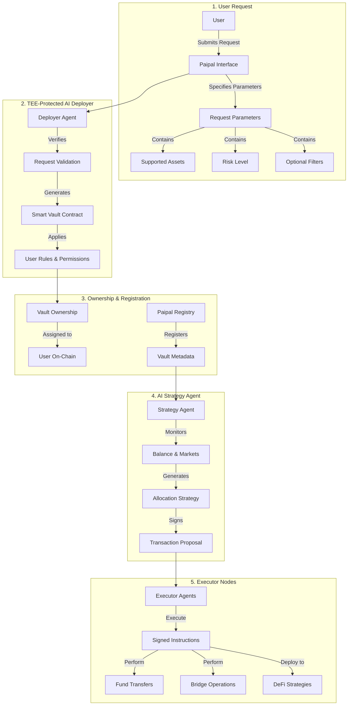

# 

  <h1>🏛️ Vault Deployment Flow</h1>
  
<strong>AI-to-AI Coordination for Secure, Automated DeFi</strong>

  
  
  
  

---

# 🚀 Vault Deployment Flow (v0.2)
## AI-to-AI Coordination for Secure, Automated DeFi

### 1. User Requests Vault Creation
A user submits a vault creation request via the Paipal interface or smart contract.

They specify:
- Supported assets (e.g. USDC, ETH)
- Risk level (e.g., low, medium, degen)
- Optional filters or constraints

### 2. TEE-Protected AI Deployer Instantiates the Vault
The request is handled by the Deployer Agent, an AI running inside a Trusted Execution Environment (TEE).

This agent:
- Verifies the request
- Generates the smart vault contract
- Applies user-defined rules and permissions

Permissions are minimal and trustless:
- Only the user can trigger withdrawals
- Only verified Executor Agents can move funds into strategies (never to arbitrary wallets)
- Cross-chain transfers are permissioned via secure channels (e.g., AggLayer + TEE signatures)

### 3. Ownership Assignment & Vault Registration
Vault ownership is assigned to the user on-chain.

The vault is registered in the Paipal Registry, allowing the AI Strategy Agent to start monitoring.

Metadata (risk score, preferences) is stored off-chain or in encrypted TEE memory.

### 4. AI Strategy Agent Kicks In
The AI Strategy Agent (also inside a TEE) starts:
- Monitoring the vault's balance and market conditions
- Generating allocation strategies based on risk preferences

Once it finds an optimal plan, it:
- Signs the proposed transaction
- Publishes it on-chain or to a secure message bus for Executor Agents

### 5. Executor Nodes Perform the Allocation
Executor Agents (community-run nodes) pick up signed instructions.

They cannot change or interpret logic — only execute:
- Transfer funds
- Bridge if needed
- Deploy to strategy (e.g. Aave, GMX, Curve)

Execution is trustless and verifiable:
- Instruction includes AI signature
- Executors are rewarded only if the action matches the AI's signed request

### 🔐 Trust Model Recap

| Component | Actor Type | TEE-Protected | Role |
|-----------|------------|---------------|------|
| Deployer Agent | AI | ✅ | Secure vault instantiation |
| Strategy Agent | AI | ✅ | Risk analysis + proposal |
| Executor Agent | Human Node | ❌ (verifies TEE signature) | Performs allocation |

# Vault Deployment Flow

## Overview
This document describes the flow of vault deployment in the Paipal Protocol system.

## Flow Description

1. **User Initiation**
   - User submits a request through the Paipal Interface
   - The request initiates the vault deployment process

2. **Paipal Interface Processing**
   - Receives user request
   - Specifies necessary parameters for vault deployment

3. **Request Parameters**
   The request includes three main components:
   - **Supported Assets**: Defines which assets will be supported by the vault
   - **Risk Level**: Specifies the risk tolerance parameters
   - **Optional Filters**: Additional configuration parameters for vault customization

4. **Deployer Agent**
   - Receives the specified parameters
   - Verifies the request through Request Validation
   - Generates the Smart Vault Contract based on validated parameters

5. **Smart Vault Contract**
   - Final deployed contract that implements the specified parameters
   - Applies the configured settings and begins operation

## Security Considerations
- All parameters are validated before deployment
- Risk levels are strictly enforced
- Asset support is verified against protocol whitelist
- Optional filters undergo security checks

## Technical Implementation
The deployment process uses a secure, multi-step verification system to ensure:
- Parameter validation
- Security checks
- Proper contract initialization
- Correct asset configuration

## Notes
- All deployments are tracked and monitored
- Changes to vault parameters require governance approval
- Risk levels cannot be modified after deployment without formal process 